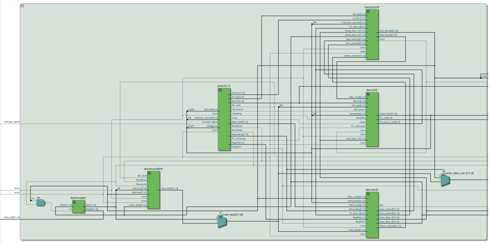
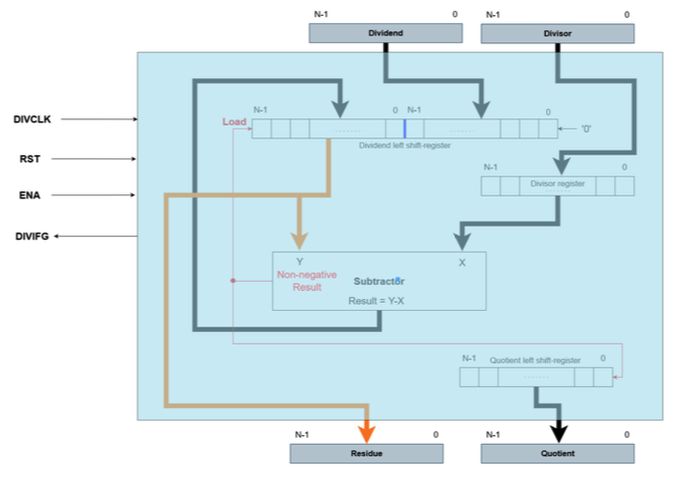
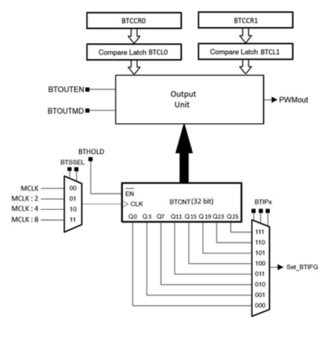

# FPGA By VHDL Project

--------------------------------------------------------------

 			README FILE
      
    	   MIPS core based MCU architecture system

               -- CPU Architecture course --
		 

## Author:
- Shay Gihaz

		      
--------------------------------------------------------------
** VHDL files are in DUT folder

	- Design, synthesis and analysis of MIPS CPU core (single cycle architecture) with
  	  Memory Mapped I/O, and interrupt capability.
	- This architecture include a MIPS ISA compatible CPU with data memory DTCM
	  and program memory ITCM for hosting the program data and code segments. 
	- The CPU have a standard MIPS register file.
	- A single clock (CLK) used in the design.
 
 Note: push-button KEY0 is the System RESET (brings the PC to the first program instruction)
 
--------------------------------------------------------------

Included VHDL files:

## MCU.vhd --> A top-level structural model for a Microcontroller Unit (MCU) implemented in VHDL.
This file serves as the wrapper for the entire system. It receives the necessary inputs and outputs, connecting all the components listed below.
 

## MIPS.vhd --> Core CPU file for the desired architecture.
It handles communication with various memory units, executes received instructions, and manages the entire system, including sending control lines.

## CONTROL.vhd --> Aggregates all the control lines that the MIPS core sends to the system. 
It can receive an instruction line, decode it, and then output the relevant signals to the subsequent stages.

## IDECODE.vhd --> Manages the core's internal register handling. 
It receives instructions and control lines, directs the relevant content to the correct register, and flows the information within the system and to memory through additional components.

## DMEMORY.vhd --> Connects the core to the DTCM.

## EXECUTE.vhd --> Contains the core's execution unit, specifically the ALU.
It receives control lines, converts them into the required computational operations, and then transfers the computed content to either memory or registers as directed by the CONTROL file.

## IFETCH.vhd --> Connects the core to the ITCM.
Responsible for communicating with the instruction memory, fetching instructions, and performing branching operations if required. It is connected to the necessary control lines in the CONTROL unit.

## Shifter.vhd --> A component that performs right or left shifts, implemented in Lab 3.

## BidirPin.vhd --> Bi-directional pin interface
allowing controlled data flow through a shared I/O pin. The Dout signal drives the IOpin when enabled (en='1'), and the Din signal captures the value from the IOpin when Dout is not driving it.

## Divider_env.vhd --> A hardware accelerator performs unsigned integer division.
It communicates externally and receives the necessary signals for the computation. This file’s role is to use interrupts along with the Divider core.

## Divide_Datapath.vhd --> Core file performs the division algorithm for two unsigned binary numbers.

## Divide_control.vhd --> Contains the FSM of the divider and transitions between states.

## binToSegConv.vhd --> Decodes the given hex value into the appropriate combination for the relevant number on the HEX display on the FPGA board.

## interrupt_control.vhd --> Manages the interrupt control mechanism within the MIPS-based microcontroller unit (MCU).
It coordinates multiple interrupt signals from various peripherals, ensuring that the MCU can prioritize and respond effectively. This component interfaces with the processor by generating an interrupt signal when any of the configured interrupt flags (IFGs) are set and the global interrupt enable (GIE) is active. It also handles the clearing of interrupt flags through software or hardware acknowledgment, maintaining the system’s responsiveness to new interrupt events. This functionality is crucial for the MCU's real-time performance, allowing the processor to handle external events promptly while minimizing the impact on ongoing processes.

## GPIO.vhd --> GPIO module facilitates seamless interaction with external peripherals such as LEDs, switches, ect through memory-mapped I/O.
The design includes an address decoder to selectively control various outputs based on specific memory addresses. It also incorporates a bidirectional pin interface (BidirPin) to manage data flow between the internal data bus and external devices, ensuring flexible and efficient communication. This GPIO module is an integral part of the MCU, enabling users to easily interface with and control external hardware within their FPGA design.

## Timer.vhd --> Timer component with PWM (Pulse Width Modulation) capabilities and memory-mapped I/O support. 
This timer allows precise control over timing events and PWM signal generation, essential for various embedded system applications. The component includes configurable clock division, multiple registers for control and comparison (BTCTL, BTCNT, CCR0, CCR1), and supports memory-mapped interactions, enabling seamless integration with other hardware components. The timer is designed to be flexible, supporting different modes of operation and generating interrupts (BTIFG) based on customizable thresholds. This project demonstrates the effective use of VHDL in creating a robust timer suitable for a wide range of applications.

